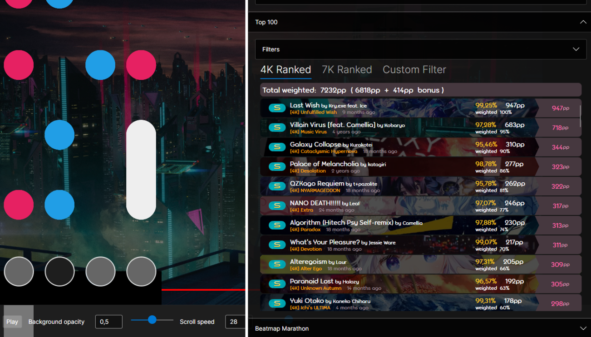
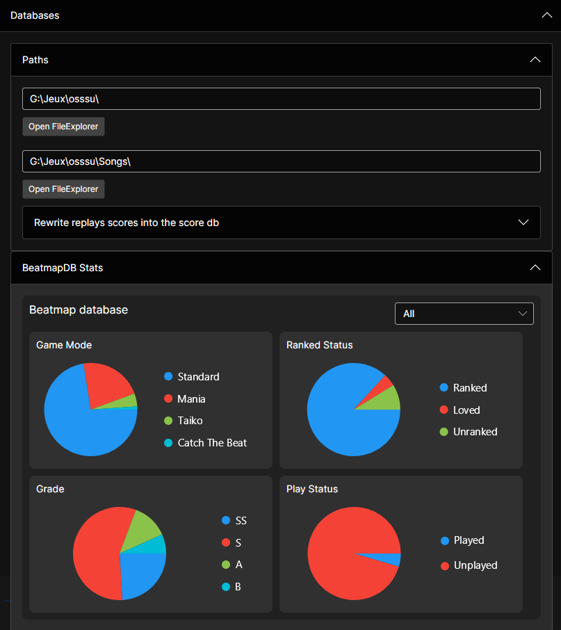
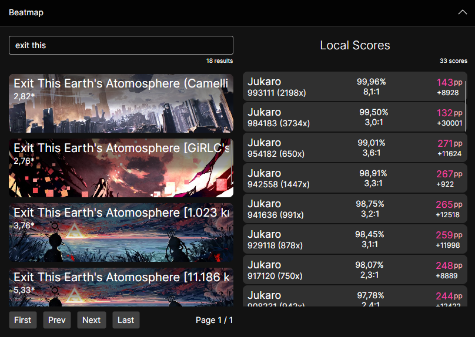
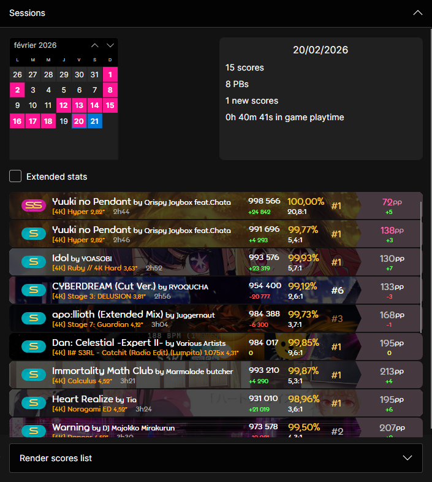
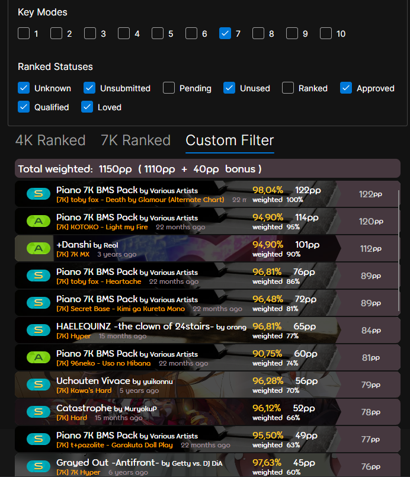
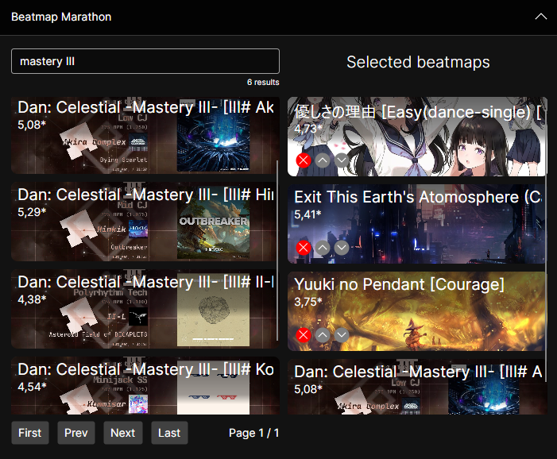
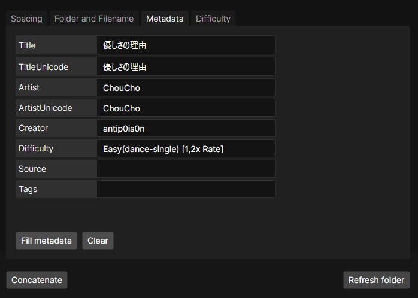

# Mania2mp4

A desktop assistant tool for osu!mania players, built with Avalonia UI (.NET 9). It lets you explore your local scores and sessions, visualize replays, analyze your top plays, and create custom marathon beatmaps all from a single interface.

---

## Features

### Databases

Configure your osu! installation path and songs folder. The app reads your local beatmap, score, and collection databases directly from osu! files. You can view database statistics and rebuild the score database from raw replay files if needed.

### Beatmap Local Scores

Search your beatmap library by title, artist, difficulty, creator, or tags. Results are paginated and display beatmap thumbnails. Selecting a beatmap lists all your local scores and replays for it, which you can then open in the replay viewer.

### Replay Viewer

Visualize any osu!mania replay against its beatmap using your chosen skin. The viewer renders player inputs in real time with play/pause controls, adjustable scroll speed, and background opacity settings.

### Skin Selector

Browse all skins available in your osu! skins folder and pick the one used by the replay viewer.

### Session Viewer

Browse your gameplay sessions organized by date on a calendar. Selecting a session shows aggregate statistics (duration, accuracy, PP earned, etc.) and a full list of scores played during that session, with the option to open any replay directly.

### Top 100

View your top 100 scores with flexible filtering. Pre-configured filter sets cover 4K ranked and 7K ranked plays, and you can define custom filters by key mode, ranked status, and player name. The view displays weighted PP totals including bonus PP.

### Beatmap Marathon

Build a custom marathon `.osu` beatmap by concatenating multiple beatmaps in a chosen order. Configure spacing between segments (time-based or beat-aligned), set metadata (title, artist, difficulty name), and adjust difficulty parameters. The generated file is saved directly into your songs folder.

---

## Tech Stack

- **UI**: Avalonia UI 11
- **Language**: C# / .NET 9
- **Architecture**: MVVM (CommunityToolkit.Mvvm), Dependency Injection
